# Jarkom-Modul-1-I04-2022

**Module 1 Practicum Report**

Group Members:

+ Farzana Afifah Razak - 5025201130
+ Muhammad Azka Aysar Santoso - 5025201150
+ Raihan Farid - 5025201141

## Important Links

+ [Questions](https://docs.google.com/document/d/1e5fXdleV59vFthVeK0O5WfmuOYV6xi6WkpHsZEiBofE/edit?usp=sharing)
+ [Resources](https://docs.google.com/document/d/1WcElh3NxoqVzibwBwo-fZ0l6eK3pEtx7gW60r2KSZMM/edit)

## Table of Contents

- [Jarkom-Modul-1-I01-2022](#jarkom-modul-1-i01-2022)
  - [Important Links](#important-links)
  - [Table of Contents](#table-of-contents)
  - [Answers](#answers)
    - [Question 1](#question-1)
    - [Question 2](#question-2)
    - [Question 3](#question-3)
    - [Question 4](#question-4)
    - [Question 5](#question-5)
    - [Question 6](#question-6)
    - [Question 7](#question-7)
    - [Question 8](#question-8)
    - [Question 9](#question-9)
    - [Question 10](#question-10)
  - [Revisions](#revisions)

## Answers

### Question 1

With the help of wireshark filter _tcp.host_, we can see which server are using the tcp protocol to request a GET method to retreive and request data from a specified resource in a server. From our experiment we can see that the web server used by monta.if.its.ac.id was `nginx/1.10.3` shown by the picture below  
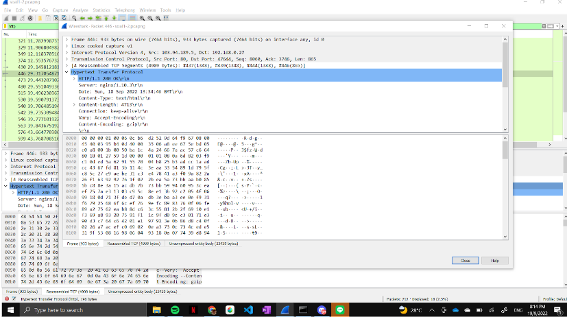

### Question 2

By using Ishaq's ip address of `103.94.189.5`, we can filter his network traffic by searching a tcp protocol that is using a GET request which contains topik in the request.

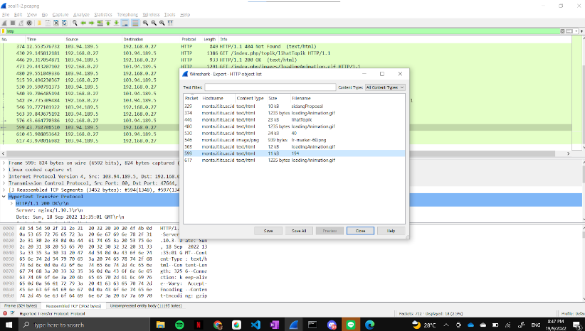

Therefore, we can conclude that this is the topic that Ishaq open. Using our own browser to send a GET request to the server with the same value as Ishaq's, we can see the topic that Ishaq's looking for which is Evaluasi untuk kerja User Space Filesystem (FUSE). 
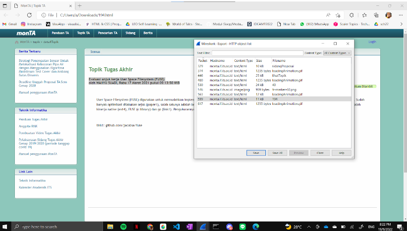

### Question 3

filtering packets that only going to port 80 can be easily done by applying command `tcp.dstport == 80` .  
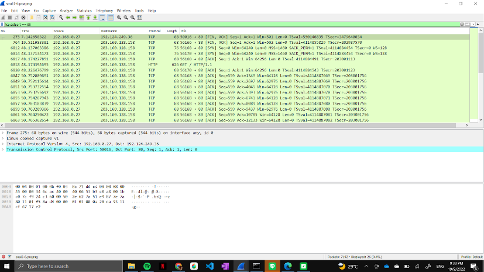

### Question 4

in order to get information about packets that only coming from port 21 in our network traffic we can do that by applying filter by using command `tcp.srcport == 21`  
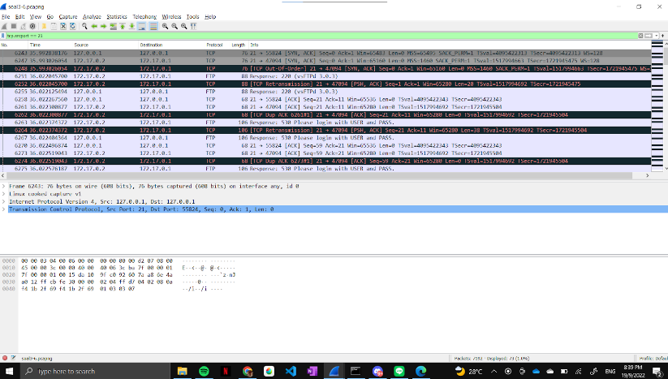

### Question 5

We can filter our network traffic coming only from port 443 by using the command `tcp.srcport == 443`. 
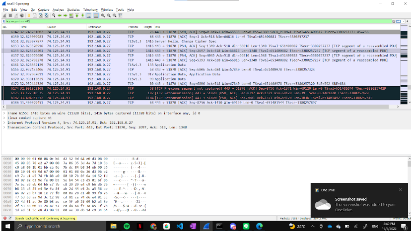

### Question 6

To see packets only going to a specific domain, we used `http.host == lipi.go.id`. 
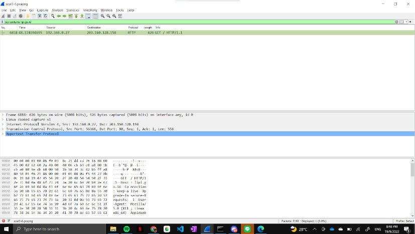

### Question 7

if we were using an Windows OS, we could open the Command Prompt and use the `ipconfig` to find out our current IP address (IPv4), after that we could just use `ip.src`:

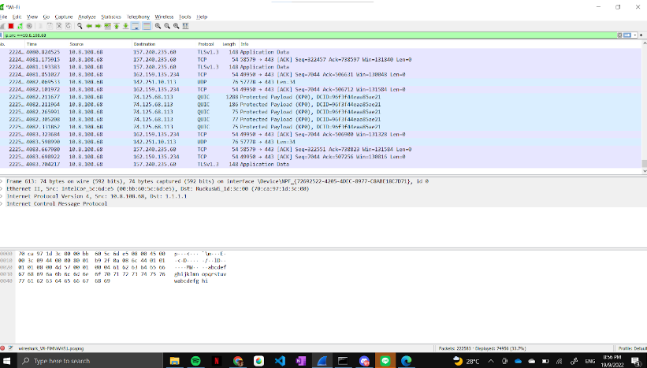

### Question 8

first, we input this code  into the filter:  
`(tcp.flags.syn == 1 && tcp.flags.ack == 0) || (tcp.flags.syn == 1 && tcp.flags.ack == 1)`

then search for the network that shown [SYN,ACK] in the network, and click follow network, then we can get the result :

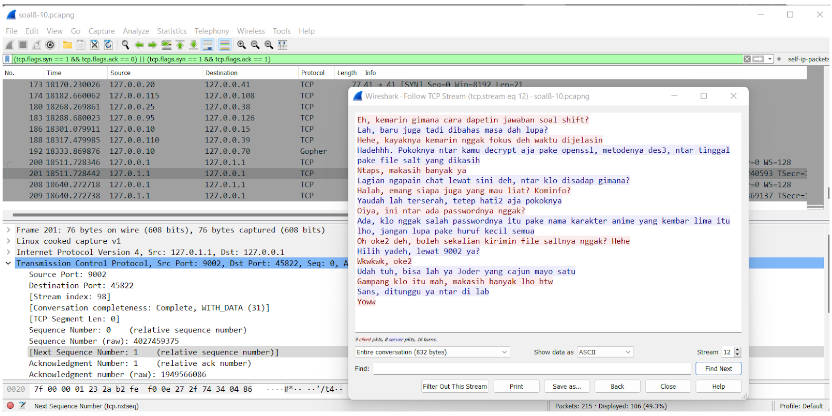

### Question 9

After we input this code previously : `(tcp.flags.syn == 1 && tcp.flags.ack == 0) || (tcp.flags.syn == 1 && tcp.flags.ack == 1)`

then, we search in the network that has the info of COMPLETE_DATA[31], then follow that network

after that, change  the code into raw, and download that data using the format **[group_name].des3**

in which it would display:

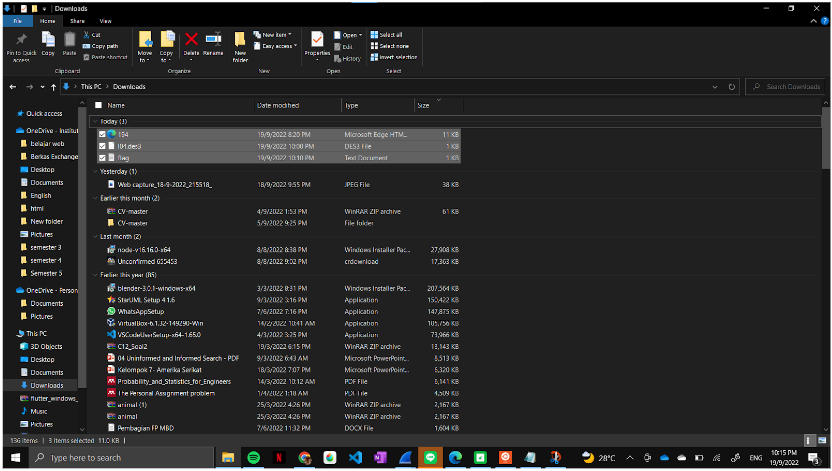

### Question 10

After previously at number 8, stated that the password of the encrypted file is **'Ada, klo nggak salah passwordnya itu pake nama karakter anime yang kembar lima itu lho, jangan lupa pake huruf kecil semua'**, after that, we try to use each name of the each character of that anime, and we found the password was **nakano**, we use ubuntu to decrypt the file, and the result was :

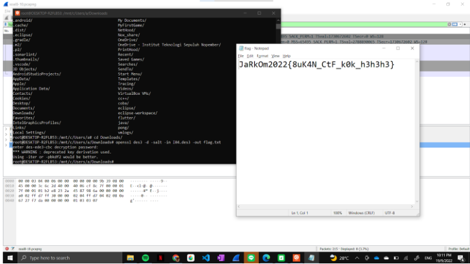

